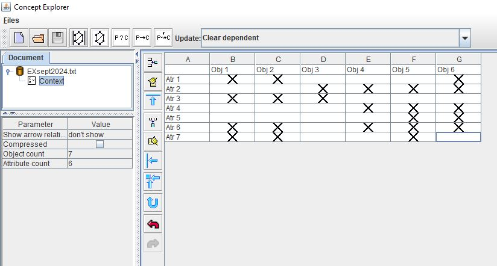
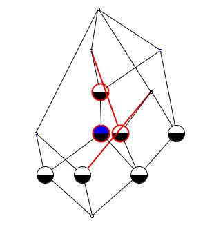
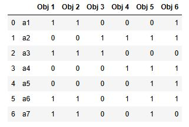
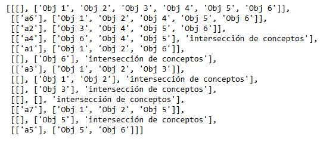
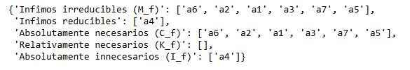
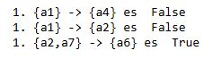

# FCA Algorithms in Python

Python implementation of algorithms from Formal Concept Analysis (FCA), including concept lattice construction, attribute reduction, reduct computation and implication analysis.

## Overview

The workflow is:

1. Define an object–attribute relation in ConExp.
2. Export the relation as `.txt`.
3. Parse the file in Python and convert it into a structured dataframe.
4. Build the concept table.
5. Classify attributes according to reduction theory.
6. Compute consistent sets (reducts).
7. Validate implications between sets of attributes.

## Implemented features

### Concept analysis
- Construction of concept tables from object–attribute relations.
- Analysis of concept relationships.

### Attribute classification
The project classifies attributes into:

- Infimum irreducibles (M_f)
- Infimum reducibles
- Absolutely necessary attributes (C_f)
- Relatively necessary attributes (K_f)
- Absolutely unnecessary attributes (I_f)

### Reduct computation
Generation of:
- Consistent attribute sets
- Reducts

### Implication validation
Implementation of:

```python
implicacion_valida(atr1, atr2, df)
```

Checks whether one attribute set implies another over the given relation.

## Technologies
- Python
- Pandas
- ConExp (for relation generation and concept lattices)

## Example outputs
(Add screenshots here)

### Input relation



### Concept lattice



### Program output
- Dataframe

- The concept table

- The classification of attributes

- Result of examples of implications


## Repository structure
```bash
.
├── data/
├── src/
├── images/
├── analisis_conceptos.ipynb
└── README.md
```

## Academic context
This project combines mathematical theory and algorithmic implementation, focusing on formal concept analysis, attribute reduction and implication reasoning.
